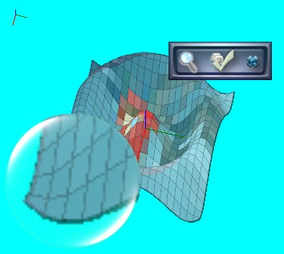

# Simple Magnifier

This is a personal project that I wrote many years ago (circa 2007), and just recently moved it to GitHub.

It is a simple application. However, it still demonstrates a few interesting points: First of all, it shows how to capture a screen image, double buffering, moving a Windows form programmatically, and serializing/deserializing configuration information through XmlSerializer. Second of all, the little application is designed to be a fun application in my mind, so it doesn't follow conventional Windows programming steps. Instead, I've used a very small borderless window as the main form. It has only 3 buttons (actually, hot spots) to do all functionality it provides. The first one instantiates a magnifier form, the second one to do the configuration, and finally, the third one is to exit from application.

Here is a screenshot of the application:

Original write-up can be found here: https://www.codeproject.com/Articles/18235/Simple-Magnifier

# Notes

Currently not working with multiple monitors. This is the most requested feature that I saw in different places including the StackOverflow site.
